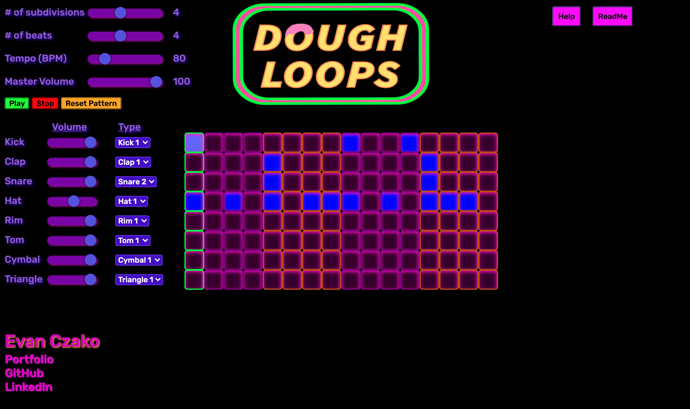
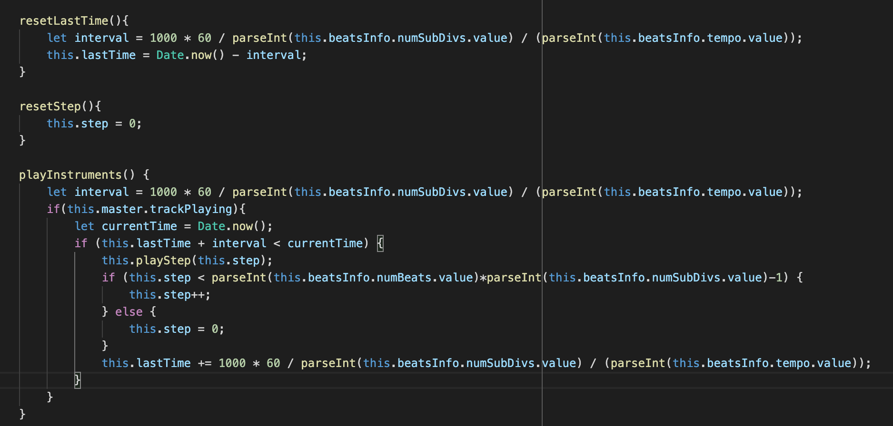
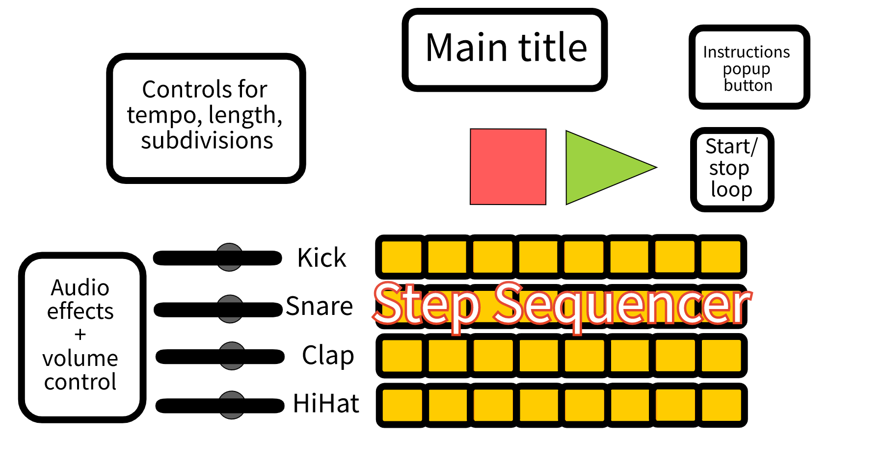

# DoughLoops

A dynamic, browser based drum machine.

## Background

DoughLoops is a simple step-sequencer that allows users to make drum beats. They have the ability to click on a grid to add or remove sounds that are triggered at the appropriate time when users press the “Play” button. The pattern is be played on an infinite loop until users press the “Stop” button. Users have the ability to adjust the volume of the different drum sounds, the sound for each drum, the tempo of the loop, the length of the loop, and the number of subdivisions for each beat.

Try it now: https://evanczako.github.io/DoughLoops/

## Functionality and MVPs

With the DoughLoops step sequencer, users are able to:

 - Start and stop their loops
 - Select squares on the step sequencer grid to create unique drum patterns
 - Edit the length of the pattern and the number of subdivisions per beat
 - Adjust the tempo of the main track and the volume of the individual instruments
 - The type of sound for each individual instrument

 In addition, this project includes:

 - An instructions tab explaining how to use the step sequencer
 - A production README
 - Links to my LinkedIn, GitHub, and portfolio

## Code Snippets

 - The below functions demonstrate my methodology for offsetting the imprecisions of JavaScripts setInterval function to ensure the long term accuracy of the DoughLoops BPM metric. I use a JavaScript Date object as an absolute benchmark for determining how much lag there is after each beat.

## Wireframes

## Technologies, Libraries, and APIs

This project was implemented with the following technologies:
 
 - HTML, CSS, and JavaScript

Note: In a future version, Web Audio API may be used to allow users to add audio effects such as reverb to the individual drum sounds.

## Implementation timeline

- Friday afternoon and weekend: Get Webpack running successfully. Create a step sequencer grid based on the user's input for the "# of beats" and "# of subdivisions" fields. Add individual track volume and tempo features.

- Monday: Brush up tempo feature to account for lag and allow users to select different drum sounds.

- Tuesday: Begin stylizing project with CSS.

- Wednesday: Add help button, finish stylizing with CSS, and deploy project to GitHub.

- Thursday morning: Update README.
